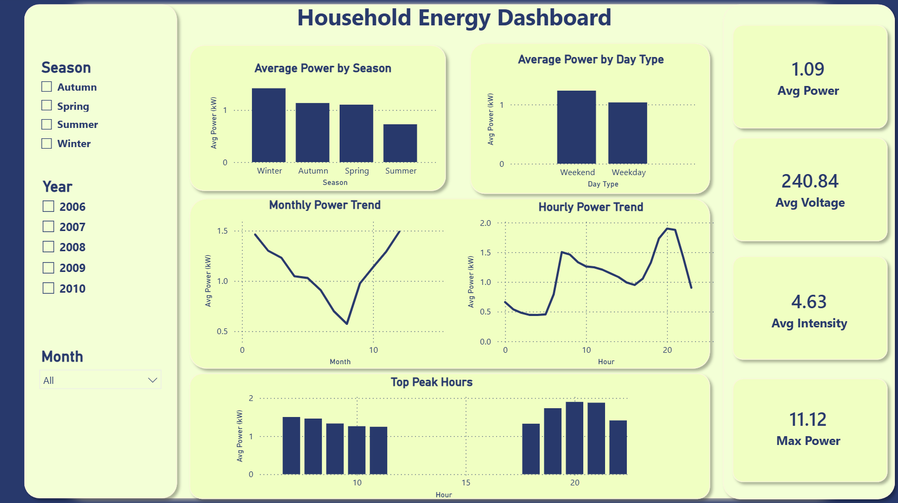

# Household Energy Consumption Analysis

## Project Overview

This project analyzes household electricity consumption data to understand energy usage patterns over time.

The main goal is to explore how electricity consumption changes by hour, day type, month, and season. The project includes data conversion, data cleaning, feature engineering, exploratory data analysis, and an interactive Power BI dashboard.

---

## Tools Used

- Python
- Pandas
- Matplotlib
- Power BI
- GitHub

---

## Dataset

The dataset contains household electricity consumption records collected over several years.

The original dataset was provided as a TXT file and was converted to CSV using Python.

Main columns include:

- Date
- Time
- Global_active_power
- Global_reactive_power
- Voltage
- Global_intensity
- Sub_metering_1
- Sub_metering_2
- Sub_metering_3

Additional columns were created during preprocessing:

- DateTime
- Year
- Month
- Day
- Hour
- Weekday
- Day_Type
- Season
- Sub_metering_total

---

## Data Cleaning and Preparation

The data preparation process included:

- Converting the original TXT file into CSV format.
- Loading the dataset using Pandas.
- Combining Date and Time into a single DateTime column.
- Creating time-based features such as Year, Month, Day, Hour, and Weekday.
- Handling missing values by removing incomplete rows.
- Creating a total sub-metering consumption column.
- Saving the cleaned dataset for Power BI dashboard development.

---

## Key Insights

- The dataset contains more than 2 million household electricity consumption records.
- The average global active power is approximately 1.09 kW.
- The maximum global active power is 11.12 kW.
- The average voltage is approximately 240.84 volts.
- The average global intensity is approximately 4.63 amps.
- Energy consumption is higher during evening hours, especially around 20:00 and 21:00.
- Weekend consumption is slightly higher than weekday consumption.
- Winter has the highest average energy consumption.
- Summer has the lowest average energy consumption.
- Daily electricity consumption shows noticeable fluctuations over time.

---

## Dashboard Preview



---

## Project Structure

```text
Energy-Consumption-Analysis/
│
├── data/
│   ├── household_power_consumption.csv
│   └── clean_energy_consumption_data.csv
│
├── notebook/
│   └── energy_consumption_analysis.ipynb
│
├── dashboard/
│   └── Energy_Consumption_Dashboard.pbix
│
├── images/
│   └── dashboard_screenshot.png
│
└── README.md
```


## Power BI Dashboard

The Power BI dashboard includes:

- Average power
- Maximum power
- Average voltage
- Average intensity
- Average power by hour
- Monthly power trend
- Average power by season
- Average power by day type
- Top peak consumption hours
- Interactive filters by year, season, and month

---


## Project Files

Due to GitHub file size limitations, the full Power BI dashboard file and large dataset are available through Google Drive.

[Download Full Project Files](https://drive.google.com/drive/folders/10pqFrpj_MH_xR5SU_7WPsYQ7KYOyKOKV?usp=sharing)

## Conclusion

This project provides insights into household electricity consumption patterns. The analysis shows that electricity usage varies by hour, month, day type, and season. The highest consumption occurs during evening peak hours and winter months, while summer shows the lowest average consumption.

The interactive Power BI dashboard helps present these patterns clearly and allows users to explore the data in a simple and effective way.